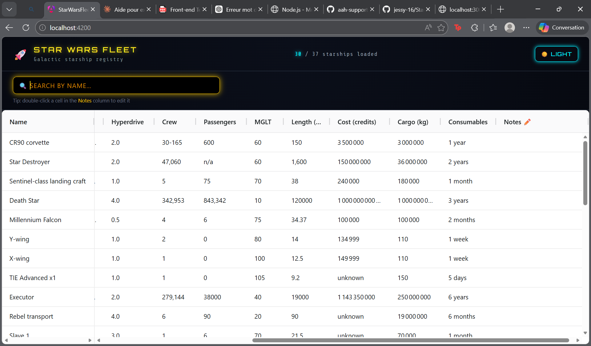

🚀 Star Wars Fleet

A web application that displays a galactic registry of Star Wars starships using the SWAPI API, with infinite scrolling, search, and editable notes.

📦 Installation & Run

# Clone the repository
git clone <your-repo-url>

# Go into the project
cd star-wars-fleet

# Install dependencies
npm install

# Run the app
ng serve
Then open:
👉 http://localhost:4200

🌌 Chosen SWAPI Resource

The application uses the /starships resource from SWAPI.

Each starship includes:

Name
Model
Class
Manufacturer
Crew / Passengers
Hyperdrive rating
Cargo / Cost
And more...

♾️ Infinite Scroll Implementation

Infinite scrolling is implemented using AG Grid Infinite Row Model.

How it works:
Data is fetched page by page (SWAPI returns 10 items per page)
The grid requests new data via a custom datasource
When the user scrolls:
getRows() is triggered
The correct page is calculated:

const page = Math.floor(params.startRow / PAGE_SIZE) + 1;
The API is called with that page

🚫 No Loader While Scrolling

To respect the requirement:

No spinner is shown during scroll
Data appears seamlessly as it's fetched
Only initial loading has a loader

✏️ Editable Columns
Editable column:
Notes
Behavior:
Double-click a cell in the "Notes" column to edit
Changes are stored only on the client side
Storage:
Map<string, Partial<Starship>>
Key = starship.url
Value = edited fields
Why?
Avoid modifying API data
Keep edits persistent during session

📏 Column Resizing

Column resizing is handled by AG Grid:
resizable: true

Users can:

Drag column edges
Adjust width dynamically
🔍 Search Feature
Search input is debounced (400ms)
Uses RxJS:
debounceTime(400)
distinctUntilChanged()
Clears cache and reloads data when search changes

⚡ Caching System
Pages are cached in the service
Prevents duplicate API calls
service.isCached(page)

Improves performance and UX
🎨 UI & Features
Dark mode by default 🌙
Toggle button for Light/Dark mode
Custom loader with progress bar
Futuristic Star Wars-inspired design
Terminal-style animations
Responsive layout
📚 Third-Party Packages
Main libraries used:
Angular – Frontend framework
AG Grid – Data grid (infinite scroll, editing, resizing)
RxJS – Reactive programming (search debounce)
⚠️ Trade-offs & Limitations
SWAPI is a public API → can be slow or unavailable
Only 37 starships exist → limited dataset
Edits are:
Not persisted (lost on refresh)
Stored only in memory
No backend (pure frontend project)
🧪 Tests
Unit tests implemented for the service
HTTP calls mocked using:
HttpClientTestingModule
HttpTestingController

Covers:
Data fetching
Caching
Search params
Error handling
🧠 Possible Improvements

Persist notes (localStorage or backend)
Add pagination indicators
Improve loader realism (based on real API timing)
Add sorting & filtering
Deploy online

## 📸 Preview

